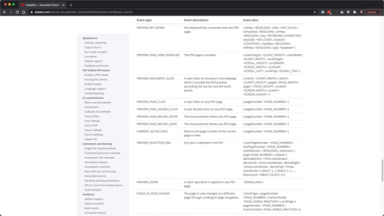

# Controla la experiencia online de tu PDF y recopila análisis

¿Su organización publica PDF en su sitio web? Aprenda a utilizar la API Adobe PDF Embed para controlar el aspecto, permitir la colaboración y recopilar análisis sobre cómo interactúan los usuarios con los PDF, incluido el tiempo dedicado a una página y las búsquedas. Para comenzar este tutorial práctico de 4 partes, seleccione *Introducción a la API de incrustación de PDF*.

<table style="table-layout:fixed">
<tr>
  <td>
    <a href="controlpdfexperience.md#part1">
        
    </a>
    <div>
    <a href="controlpdfexperience.md#part1"><strong>Parte 1: Introducción a la API de incrustación de PDF</strong></a>
    </div>
  </td>
  <td>
    <a href="controlpdfexperience.md#part2">
        
    </a>
    <div>
    <a href="controlpdfexperience.md#part2"><strong>Parte 2: Agregando la API de incrustación de PDF a una página web</strong></a>
    </div>
  </td>
  <td>
   <a href="controlpdfexperience.md#part3">
      
   </a>
    <div>
    <a href="controlpdfexperience.md#part3"><strong>Parte 3: Acceso a las API de Analytics</strong></a>
    </div>
  </td>
  <td>
   <a href="controlpdfexperience.md#part4">
      
   </a>
    <div>
    <a href="controlpdfexperience.md#part4"><strong>Parte 4: Agregar interactividad basada en eventos</strong></a>
    </div>
  </td>
</tr>
</table>

## Parte 1: Introducción a la API de incrustación de PDF {#part1}

En la parte 1, aprenda a empezar con todo lo que necesita para las partes 1-3. Empezará a obtener las credenciales de la API.

**Lo que necesitas**

* Recursos del tutorial [descargar](https://github.com/benvanderberg/adobe-pdf-embed-api-tutorial)
* Adobe ID [consigue uno aquí](https://accounts.adobe.com/es)
* Servidor web (Node JS, PHP, etc.)
* Conocimiento del funcionamiento del HTML / JavaScript / CSS

**Lo que estamos usando**

* Un servidor web básico (Node)
* Visual Studio Code
* GitHub

### Obtención de credenciales

1. Vaya al [sitio web Adobe.io](https://www.adobe.io/).
1. Haga clic en **[!UICONTROL Más información]** en Crear experiencias de documentos atractivas.

   

   Esto le llevará a la página principal de [!DNL Adobe Acrobat Services].

1. Haga clic en **[!UICONTROL Introducción]** en la barra de navegación.

   Verá una opción en **Introducción a las [!DNL Acrobat Services] API** para **Crear nuevas credenciales** o **Administrar credenciales existentes**.

1. Haga clic en el botón **[!UICONTROL Introducción]** en **[!UICONTROL Crear nuevas credenciales]**.

   

1. Elija el botón de opción **[!UICONTROL PDF Embed API]** y añada un nombre de credencial de su elección y un dominio de aplicación en la siguiente ventana.

   >[!NOTE]
   >
   >Estas credenciales solo se pueden utilizar en el dominio de aplicación que se muestra aquí. Puede utilizar cualquier dominio que elija.

   

1. Haga clic en **[!UICONTROL Crear credenciales]**.

   La página final del asistente proporciona los detalles de las credenciales de cliente. Deje esta ventana abierta para poder volver a ella y copiar el ID de cliente (clave de API) para usarlo más adelante.

1. Haga clic en **[!UICONTROL Ver documentación]** para ir a la documentación con información detallada sobre cómo usar esta API.

   

## Parte 2: Añadir la API de incrustación de PDF a una página web {#part2}

En la parte 2, aprenderás a incrustar fácilmente la API de incrustación de PDF en una página web. Para ello, utilizarás la demostración online de la API de Adobe PDF Embed API para crear tu código.

### Obtener el código de ejercicio

Hemos creado código para que lo utilice. Aunque puede utilizar su propio código, las demostraciones se realizarán en el contexto de los recursos del tutorial. Descargue el código de ejemplo [aquí](https://github.com/benvanderberg/adobe-pdf-embed-api-tutorial).

1. Vaya al [[!DNL Adobe Acrobat Services] sitio web](https://www.adobe.io/apis/documentcloud/dcsdk/).

   ![Captura de pantalla del sitio web [!DNL Adobe Acrobat Services]](assets/ControlPDF_6.png)

1. Haga clic en **[!UICONTROL API]** en la barra de navegación y, a continuación, vaya a la página **[!UICONTROL API de incrustación de PDF]** en el vínculo desplegable.

   

1. Haga clic en **[!UICONTROL Probar la demostración]**.

   Aparece una nueva ventana con el espacio aislado de desarrollador para la API de incrustación de PDF.

   

   Aquí puede ver las opciones para los diferentes modos de visualización.

1. Haga clic en los diferentes modos de visualización de Ventana completa, Contenedor de tamaño, En línea y Lightbox.

   

1. Haz clic en el modo de visualización de **[!UICONTROL Ventana completa]** y, a continuación, haz clic en el botón **[!UICONTROL Personalizar]** para activar y desactivar las opciones.

   

1. Deshabilite la opción **[!UICONTROL Descargar]** PDF.
1. Haga clic en el botón **[!UICONTROL Generar código]** para ver la vista previa del código.
1. Copie **[!UICONTROL ID de cliente]** de la ventana Credenciales de cliente de la Parte 1.

   

1. Abra el archivo **[!UICONTROL Web]** -> **[!UICONTROL resources]** -> **[!UICONTROL js]** -> **[!UICONTROL dc-config.js]** en el editor de código.

   Verá que la variable clientID está allí.

1. Pegue las credenciales de cliente entre comillas dobles para establecer el ID de cliente en sus credenciales.

1. Vuelva a la vista previa del código del espacio aislado del desarrollador.

1. Copie la segunda línea que tiene el script de Adobe:

   ```
   <script src=https://documentccloud.adobe.com/view-sdk/main.js></script>
   ```

   

1. Vaya al editor de código y abra el archivo **[!UICONTROL Web]** -> **[!UICONTROL exercise]** -> **[!UICONTROL index.html]**.

1. Pegue el código de script en `<head>` del archivo en la línea 18 bajo el comentario que dice: **TODO: EJERCICIO 1: INSERTAR ETIQUETA DE SCRIPT DE API EMBED**.

   

1. Vuelva a la vista previa del código del espacio aislado del desarrollador y copie la primera línea de código que tenga:

   ```
   <div id="adobe-dc-view"></div>
   ```

   

1. Vaya al editor de código y abra de nuevo el archivo **[!UICONTROL Web]** -> **[!UICONTROL exercise]** -> **[!UICONTROL index.html]**.

1. Pegue el código `<div>` en `<body>` del archivo en la línea 67 bajo el comentario que dice **TODO: EJERCICIO 1: INSERTAR CÓDIGO DE API EMBED DEL PDF**.

   

1. Vuelva a la vista previa del código del espacio aislado del desarrollador y copie las líneas de código de `<script>` siguientes:

   ```
   <script type="text/javascript">
       document.addEventListener("adobe_dc_view_sdk.ready",             function(){ 
           var adobeDCView = new AdobeDC.View({clientId:                     "<YOUR_CLIENT_ID>", divId: "adobe-dc-view"});
           adobeDCView.previewFile({
               content:{location: {url: "https://documentcloud.                adobe.com/view-sdk-demo/PDFs/Bodea Brochure.                    pdf"}},
               metaData:{fileName: "Bodea Brochure.pdf"}
           }, {showDownloadPDF: false});
       });
   </script>
   ```

1. Vaya al editor de código y abra de nuevo el archivo **[!UICONTROL Web]** -> **[!UICONTROL exercise]** -> **[!UICONTROL index.html]**.

1. Pegue el código `<script>` en `<body>` del archivo en la línea 68 bajo la etiqueta `<div>`.

1. Modifique la línea 70 del mismo archivo **index.html** para incluir la variable clientID creada anteriormente.

   

1. Modifique la línea 72 del mismo archivo **index.html** para actualizar la ubicación del archivo PDF y utilizar un archivo local.

   Hay uno disponible en los archivos del tutorial en **/resources/pdfs/whitepaper.pdf**.

1. Guarda tus archivos modificados y obtén una vista previa de tu sitio web yendo a **`<your domain>`/summit21/web/exercise/**.

   Debería ver el informe técnico en modo de ventana completa en el navegador.

## Parte 3: Acceso a las API de Analytics {#part3}

Ahora que ha creado correctamente una página web que tiene la API de PDF Embed representando a un PDF, en la parte 3 puede explorar cómo utilizar eventos de JavaScript para medir análisis para comprender cómo los usuarios utilizan PDF.

### Encontrar documentación

Hay una gran cantidad de eventos de JavaScript diferentes disponibles como parte de la API de PDF Embed. Puede tener acceso a ellos desde la documentación de [!DNL Adobe Acrobat Services].

1. Vaya al sitio de [documentación](https://www.adobe.io/apis/documentcloud/dcsdk/docs.html).
1. Revise los diferentes tipos de eventos disponibles como parte de la API. Estos son útiles como referencia y también serán útiles para sus futuros proyectos.

   

1. Copie el código de ejemplo que aparece en el sitio web.

   Utilice esto como base para nuestro código y modifíquelo.

   

   ```
   const eventOptions = {
     //Pass the PDF analytics events to receive.
      //If no event is passed in listenOn, then all PDF         analytics events will be received.
   listenOn: [ AdobeDC.View.Enum.PDFAnalyticsEvents.    PAGE_VIEW, AdobeDC.View.Enum.PDFAnalyticsEvents.DOCUMENT_DOWNLOAD],
     enablePDFAnalytics: true
   }
   
   
   adobeDCView.registerCallback(
     AdobeDC.View.Enum.CallbackType.EVENT_LISTENER,
     function(event) {
       console.log("Type " + event.type);
       console.log("Data " + event.data);
     }, eventOptions
   );
   ```

1. Busque la sección de código que agregó anteriormente que se ve como la siguiente y agregue el código anterior después de este código en **index.html**:

   

1. Cargue la página en el navegador web y abra la consola para ver las salidas de la consola de los diferentes eventos mientras interactúa con el visor del PDF.

   

   

### Añadir modificador para capturar eventos

Ahora que los eventos se envían a console.log, cambiemos el comportamiento en función de los eventos. Para ello, utilizará un ejemplo de modificador.

1. Vaya a **snippets/eventsSwitch.js** y copie el contenido del archivo en el código del tutorial.

   

1. Pegue el código en la función de escucha de eventos.

   

1. Confirme que la consola obtiene una salida correcta cuando se carga la página e interactúa con el Visor del PDF.

### Adobe Analytics

Si desea añadir la asistencia de Adobe Analytics a su visor, puede seguir las instrucciones que se indican en el sitio web.

>[!IMPORTANT]
>
>Su página web ya debe tener Adobe Analytics cargado en la página del encabezado.

Accede a la [documentación de Adobe Analytics](https://www.adobe.com/devnet-docs/dcsdk_io/viewSDK/howtodata.html#adobe-analytics) y revísala si ya tienes Adobe Analytics habilitado en tu página web. Siga las instrucciones para configurar una ReportSuite.

### Google Analytics


La API Adobe PDF Embed proporciona una integración inmediata con Adobe Analytics. Sin embargo, dado que todos los eventos están disponibles como eventos de JavaScript, es posible realizar la integración con los Google Analytics capturando los eventos del PDF y utilizando la función ga() para añadir el evento a Adobe Analytics.

1. Vaya a **snippets/eventsSwitchGA.js** para ver cómo puede integrarse con los Google Analytics.
1. Revise y utilice este código como ejemplo si su página web se rastrea con Adobe Analytics y ya está incrustada en la página web.

   

## Parte 4: Añadir interactividad basada en eventos {#part4}

En la parte 4, verás cómo colocar en la parte superior del visor del PDF un paywall que muestra después de desplazarte más allá de la segunda página.

### Ejemplo de paywall

Navega a este [ejemplo de un PDF detrás de un paywall](https://www3.technologyevaluation.com/research/white-paper/the-forrester-wave-digital-decisioning-platforms-q4-2020.html). En este ejemplo, aprenderá a añadir interactividad sobre la experiencia de visualización del PDF.

### Añadir código de paywall

1. Vaya a snippets/paywallCode.html y copie el contenido.
1. Busque `<!-- TODO: EXERCISE 3: INSERT PAYWALL CODE -->` en exercise/index.html.

   

1. Pegue el código copiado después del comentario.
1. Vaya a **snippets/paywallCode.js** y copie el contenido.

   

1. Pegue el código en esa ubicación.

### Probar una demostración con Paywall

Ahora puede ver la demostración.

1. Vuelva a cargar **index.html** en su sitio web.
1. Desplácese hacia abajo hasta una página > 2.
1. Mostrar el cuadro de diálogo aparece para desafiar al usuario después de la segunda página.

   

## Recursos adicionales

Se pueden encontrar recursos adicionales [aquí](https://www.adobe.io/apis/documentcloud/dcsdk/docs.html).
