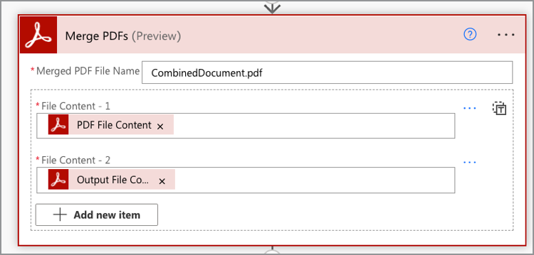

# Crea tu primer flujo en Microsoft Power Automate

Aprende a crear tu primer flujo en [Microsoft Power Automate](https://flow.microsoft.com) con el conector [Adobe PDF Services](https://us.flow.microsoft.com/en-us/connectors/shared_adobepdftools/adobe-pdf-services/).

En este tutorial práctico, aprenda a:

* Convertir documentos de Word en PDF
* Combinar documentos de PDF en un solo PDF
* Protect crea un documento de PDF con una contraseña

## Preparación

### Lo que necesitas

* **Credenciales de prueba o producción para los servicios de Adobe PDF**
Obtenga más información sobre cómo obtener y configurar credenciales en Microsoft Power Automate [aquí](https://experienceleague.adobe.com/en/docs/acrobat-services-learn/tutorials/pdfservices/getting-credentials-power-automate).
* **Microsoft Power Automate con conectores Premium**
Obtenga información sobre cómo comprobar el nivel de licencias de Power Automate [aquí](https://docs.microsoft.com/en-us/power-platform/admin/power-automate-licensing/types).
* **OneDrive**
El conector de almacenamiento de OneDrive se utiliza en este tutorial, pero se puede sustituir cualquier conector de almacenamiento.

### Archivos de muestra

Hay dos [archivos de muestra](assets/sample-assets.zip) que necesitas descomprimir y cargar en OneDrive:

* WordDocument01.docx
* WordDocument02.docx

### Obtención de credenciales

Para completar este tutorial, necesita sus credenciales ya configuradas en Microsoft Power Automate para los servicios de Adobe PDF. Si no ha completado este paso, consulte las [instrucciones aquí](https://experienceleague.adobe.com/en/docs/acrobat-services-learn/tutorials/pdfservices/getting-credentials-power-automate).

## Parte 1: Crear nuevo flujo y convertir Word a PDF

### Crear el flujo

En esta parte, creas un nuevo flujo en [Microsoft Power Automate](https://flow.microsoft.com) mediante un flujo instantáneo, añades parámetros, obtén tus archivos de OneDrive y conviértelos a PDF.

1. Navega hasta [Microsoft Power Automate](https://flow.microsoft.com) e inicia sesión con tus credenciales.
1. En la barra lateral, seleccione **[!UICONTROL Crear]**.

   

1. Seleccione **[!UICONTROL Flujo instantáneo]**.
1. Dale un nombre a tu flujo.
1. En *Elegir cómo desencadenar este flujo*, seleccione **[!UICONTROL Desencadenar manualmente un flujo]**.
1. Seleccione **[!UICONTROL Crear]**.

### Obtener el contenido de los archivos

A continuación, obtenga el contenido de los archivos de muestra.

>[!PREREQUISITES]
>
>Si no has cargado los [archivos de muestra](assets/sample-assets.zip) en OneDrive, descomprime los archivos y cárgalos.


1. En [Power Automate](https://flow.microsoft.com), seleccione **[!UICONTROL + Nuevo paso]**.
1. Busque *OneDrive* en la barra de búsqueda.
1. Elige tu cuenta personal o de trabajo de OneDrive seleccionando **[!UICONTROL OneDrive para la Empresa]** o **[!UICONTROL OneDrive]**.
1. Busque *Obtener contenido del archivo* en la barra de búsqueda.
1. En el campo **[!UICONTROL Archivo]**, selecciona el icono Carpeta para ir al archivo *WordDocument01.docx* en OneDrive.

   

### Convertir archivo a PDF

Ahora que tiene el contenido del archivo, puede convertir el documento en PDF.

1. En [Power Automate](https://flow.microsoft.com), seleccione **[!UICONTROL + Nuevo paso]**.
1. Busque *Servicios de Adobe PDF* en la barra de búsqueda.
1. Seleccione **[!UICONTROL Servicios de Adobe PDF]**.
1. Busque *Convertir Word en PDF* en la barra de búsqueda.
1. En **[!UICONTROL Nombre de archivo]**, asigne un nombre a su archivo como desee, pero debe terminar en *.docx*. Esta extensión es necesaria para convertir documentos de Word a PDF.
1. Coloque el cursor en el campo **[!UICONTROL Contenido de archivo]**.
1. Con el panel **[!UICONTROL Contenido dinámico]**, selecciona **[!UICONTROL Contenido de archivo]**.

   

### Guardar el archivo en OneDrive

Una vez que se genere el documento, vuelva a guardar el archivo en OneDrive.

1. En [Microsoft Power Automate](https://flow.microsoft.com), seleccione **[!UICONTROL + Nuevo paso]**.
1. Busque *OneDrive* en la barra de búsqueda.
1. Elige tu cuenta personal o de trabajo de OneDrive seleccionando **[!UICONTROL OneDrive para la Empresa]** o **[!UICONTROL OneDrive]**.
1. Busque *Obtener contenido del archivo* en la barra de búsqueda.
1. Busque *Crear archivo* en la barra de búsqueda.
1. Seleccione **[!UICONTROL Crear archivo]**.
1. En el campo **[!UICONTROL Ruta de carpeta]**, seleccione el icono de carpeta para especificar dónde guardar el archivo en OneDrive.
1. En **[!UICONTROL Nombre de archivo]**, asigne un nombre a su archivo como desee, pero debe terminar en *.docx*. Esta extensión es necesaria para convertir documentos de Word a PDF.
1. En el campo **[!UICONTROL Contenido de archivo]**, usa el panel **[!UICONTROL Contenido dinámico]** para insertar la variable Contenido de archivo del PDF.

### Probar flujo

1. En la esquina superior izquierda, selecciona **[!UICONTROL Sin título]** para cambiar el nombre del flujo.
1. Selecciona **[!UICONTROL Guardar]**.
1. Seleccione **[!UICONTROL Prueba]**.
1. Seleccione **[!UICONTROL Manualmente]** y luego **[!UICONTROL Guardar y probar]**.
1. Selecciona **[!UICONTROL Continuar]**.
1. Seleccione **[!UICONTROL Ejecutar flujo]**.

En la carpeta OneDrive, debería ver el PDF convertido.


## Parte 2: Generar un documento dinámico a partir de una plantilla

La siguiente parte se basa en la parte 1 y utiliza la plantilla *Generar documento a partir de Word* para combinar datos dinámicamente en el documento.

### Revisar la plantilla del documento

Abre *WordDocument02_.docx* desde tus archivos de muestra en OneDrive. El documento de Word contiene varias etiquetas de texto diferentes que representan los lugares en los que se rellenan los datos en el documento.

### Añadir parámetros al activador

Para insertar datos dinámicos en el documento, debe crear algunos parámetros para que el activador solicite valores.

1. Al editar el flujo, seleccione **[!UICONTROL Desencadenar manualmente un flujo]** para expandir la acción.
1. Seleccione **[!UICONTROL Agregar una entrada]**.
1. Seleccione **[!UICONTROL Texto]**.
1. Asigne al campo el nombre *First Name*.

Repita los pasos 2-4 para añadir los siguientes campos:

* Apellidos
* Salario


### Obtener el contenido de archivo de una plantilla

Para generar un documento, primero debe obtener el contenido del archivo de la plantilla de Word.

1. En Power Automate, seleccione + **[!UICONTROL Nuevo paso]**.
1. Busque *OneDrive* en la barra de búsqueda.
1. Elige tu cuenta personal o de trabajo de OneDrive seleccionando **[!UICONTROL OneDrive para la Empresa]** o **[!UICONTROL OneDrive]**.
1. Busque *Obtener contenido del archivo* en la barra de búsqueda.
1. En el campo **[!UICONTROL Archivo]**, selecciona el icono Carpeta para ir al archivo *WordDocument02.docx* en OneDrive.


### Generar documento a partir de plantilla

1. En Power Automate, seleccione **[!UICONTROL + Nuevo paso]**.
1. Busque *Servicios de Adobe PDF* en la barra de búsqueda.
1. Seleccione **[!UICONTROL Servicios de Adobe PDF]**.
1. Seleccione la acción **[!UICONTROL Generar documento a partir de plantilla de Word]** .
1. En el campo **[!UICONTROL Nombre de archivo de plantilla]**, nombra el archivo como desees, pero debe terminar en *.docx*.

#### Combinar datos

Con la acción *Generar documento a partir de plantilla de Word*, puede combinar en el documento datos de cualquiera de las diferentes variables que se encontraban anteriormente en el flujo mediante contenido dinámico.

Copie los datos JSON siguientes en el campo **Combinar datos**:

```
{
    "FirstName": "",
    "LastName": "",
    "Salary": ""
}
```

1. Coloque el cursor en el campo entre las dos comillas para el valor *FirstName*.
1. Mediante el panel **[!UICONTROL Contenido dinámico]**, inserte el valor *Nombre* del desencadenador manual de una acción de flujo.

   

1. Repita los pasos del 7 al 8 para los campos **[!UICONTROL LastName]** y **[!UICONTROL Salary]**.
1. En el campo **[!UICONTROL Contenido de archivo de plantilla]**, usa el panel **[!UICONTROL Contenido dinámico]** para insertar el valor **[!UICONTROL Contenido de archivo]** del paso *Obtener contenido de archivo*.


>[!TIP]
>
>La acción *Generar documento a partir de plantilla de Word* utiliza la API de generación de documentos de Adobe. Si desea obtener más información sobre cómo crear plantillas, aquí tiene algunos recursos:
>
>* [Más información sobre la generación de documentos de Adobe](https://developer.adobe.com/document-services/apis/doc-generation/)
>* [Etiquetador de generación de documentos de Adobe para Microsoft Word](https://appsource.microsoft.com/en-US/product/office/WA200002654)
>* [Documentación de la API de generación de documentos de Adobe](https://developer.adobe.com/document-services/docs/overview/document-generation-api/)

### Guardar el archivo en OneDrive

Una vez generado el documento, puede volver a guardar el archivo en OneDrive.

1. En Power Automate, seleccione **+ [!UICONTROL Nuevo paso]**.
1. Busque *OneDrive* en la barra de búsqueda.
1. Elige tu cuenta personal o de trabajo de OneDrive seleccionando **[!UICONTROL OneDrive para la Empresa]** o **[!UICONTROL OneDrive]**.
1. Busque *Crear archivo* en la barra de búsqueda.
1. Seleccione **[!UICONTROL Crear archivo]**.
1. En el campo **[!UICONTROL Ruta de carpeta]**, seleccione el icono de carpeta para especificar dónde guardar el archivo en OneDrive.
1. En el campo **[!UICONTROL Nombre de archivo]**, establezca el nombre del archivo. Como el resultado es un PDF, el nombre del archivo debe terminar con la extensión .pdf.
1. Use el panel **[!UICONTROL Contenido dinámico]** para insertar la variable Contenido de archivo del PDF en el campo **[!UICONTROL Contenido de archivo]**.

### Probar flujo


1. Selecciona **[!UICONTROL Guardar]**.
1. Seleccione **[!UICONTROL Prueba]**.
1. Seleccione **[!UICONTROL Manualmente]** y luego **[!UICONTROL Guardar y probar]**.
1. Selecciona **[!UICONTROL Continuar]**.
1. Especifique valores para *Nombre*, *Apellido* y *Salario*.
1. Seleccione **[!UICONTROL Ejecutar flujo]**.

En la carpeta OneDrive, verá un PDF generado a partir del documento de Word. Al abrir el documento de PDF en OneDrive, verá que los datos se combinan en las ubicaciones de las etiquetas de texto.


## Parte 3: Combina el PDF en uno

Ahora que ha generado y convertido un documento de Word en un PDF, la siguiente parte es combinar varios documentos de PDF.

>[!NOTE]
>
>En las acciones anteriores, guardó una copia del documento como archivo en OneDrive. Para utilizar herramientas como Combinar PDF, no es necesario guardar el archivo en OneDrive. En su lugar, puede pasar el resultado directamente de una acción a la siguiente, lo que es mejor que guardarlo en OneDrive después de cada acción. Sin embargo, con fines de demostración, está guardando estos archivos en OneDrive.

### Paso Añadir PDF de combinación

1. Al editar el flujo, seleccione **[!UICONTROL + Siguiente paso]** para agregar una acción al final del flujo.
1. Busque *Servicios de Adobe PDF* en la barra de búsqueda.
1. Seleccione **[!UICONTROL Servicios de Adobe PDF]**.
1. Seleccione la acción **[!UICONTROL Combinar PDF]**.
1. En el campo **[!UICONTROL Nombre de archivo del PDF de combinación]**, escribe el nombre de archivo deseado (p. ej.,*CombinedDocument.pdf*).
1. En el campo **[!UICONTROL Contenido de archivo -1]**, usa el panel **[!UICONTROL Contenido dinámico]** para insertar el valor *Contenido de archivo de PDF* del paso **[!UICONTROL Convertir Word en PDF]**.
1. Para agregar el siguiente documento, seleccione **+ [!UICONTROL agregar nuevo elemento]**.
1. En el campo **[!UICONTROL Contenido de archivo - 2]**, usa el panel **[!UICONTROL Contenido dinámico]** para insertar el valor **[!UICONTROL Contenido de archivo de salida]** del paso *Generar documento a partir de plantilla de Word*.



### Guardar el PDF combinado en OneDrive

Una vez combinado el documento, puede volver a guardarlo en OneDrive.

1. En Power Automate, seleccione **+ [!UICONTROL Nuevo paso]**.
1. Busque *OneDrive* en la barra de búsqueda.
1. Elige tu cuenta personal o de trabajo de OneDrive seleccionando **[!UICONTROL OneDrive para la Empresa]** o **[!UICONTROL OneDrive]**.
1. Busque *Crear archivo* en la barra de búsqueda.
1. Seleccione **[!UICONTROL Crear archivo]**.
1. En el campo **[!UICONTROL Ruta de carpeta]**, seleccione el icono de carpeta para especificar dónde guardar el archivo en OneDrive.
1. En el campo **[!UICONTROL Nombre de archivo]**, establezca el nombre del archivo. Como el resultado es un PDF, el nombre del archivo debe terminar en .pdf.
1. En el campo **[!UICONTROL Contenido de archivo]**, usa el panel **[!UICONTROL Contenido dinámico]** para insertar el valor *Contenido de archivo del PDF* del paso **[!UICONTROL Combinar PDF]**.

   

### Probar flujo

1. Selecciona **[!UICONTROL Guardar]**.
1. Seleccione **[!UICONTROL Prueba]**.
1. Seleccione **[!UICONTROL Manualmente]** y luego **[!UICONTROL Guardar y probar]**.
1. Selecciona **[!UICONTROL Continuar]**.
1. Especifique valores para *Nombre*, *Apellido* y *Salario*.
1. Seleccione **[!UICONTROL Ejecutar flujo]**.

En la carpeta OneDrive, verá el PDF combinado con las páginas del primer y segundo documento.

## Parte 4: Documento de Protect PDF

Después de generar el documento, puede protegerlo de la edición incluyendo un paso adicional antes de guardarlo en OneDrive.

### Protección de archivos PDF

1. Mientras editas tu flujo en Power Automate, selecciona **+** entre la acción **[!UICONTROL Combinar PDF]** y la acción **[!UICONTROL Crear archivo 3]**.

   

1. Seleccione **[!UICONTROL Agregar una acción]**.
1. Busque *Servicios de Adobe PDF* en la barra de búsqueda.
1. Seleccione **[!UICONTROL Servicios de Adobe PDF]**.
1. Seleccione la acción **[!UICONTROL PDF de Protect desde la visualización]**.
1. En el campo **[!UICONTROL Nombre de archivo]**, establece el nombre que desees, siempre que termine con la extensión .pdf.
1. Establezca el campo **[!UICONTROL Contraseña]** en la contraseña especificada para abrir el documento.
1. En el campo **[!UICONTROL Contenido de archivo]**, usa el panel **[!UICONTROL Contenido dinámico]** para insertar el valor *Contenido de archivo del PDF* del paso **[!UICONTROL Combinar PDF]**.

### Actualizar guardar en OneDrive

Una vez protegido el documento, puede volver a guardar el archivo en OneDrive. En este ejemplo, está actualizando la acción preexistente **Crear archivo 3** con un nuevo valor *Contenido de archivo*.

1. Seleccione el cursor en el campo **[!UICONTROL Contenido de archivo]** en la acción **[!UICONTROL Crear archivo 3]**.
1. Use el panel **[!UICONTROL Contenido dinámico]** para insertar el valor *Contenido de archivo del PDF* del paso **PDF de Protect desde la visualización**.

### Probar flujo

1. Selecciona **[!UICONTROL Guardar]**.
1. Seleccione **[!UICONTROL Prueba]**.
1. Seleccione **[!UICONTROL Manualmente]** y luego **[!UICONTROL Guardar y probar]**.
1. Selecciona **[!UICONTROL Continuar]**.
1. Especifique valores para *Nombre*, *Apellido* y *Salario*.
1. Seleccione **[!UICONTROL Ejecutar flujo]**.

En la carpeta OneDrive, verá el PDF combinado que ahora le pide que introduzca una contraseña para ver el documento.

## Pasos siguientes

En este tutorial, ha convertido un documento de Word en un PDF, ha creado un documento basado en datos, ha combinado documentos y los ha protegido con una contraseña. Para obtener más información, explore algunas de las otras acciones disponibles en el conector de Servicios de Adobe PDF en Microsoft Power Automate:

* Vea las plantillas precreadas disponibles en Microsoft Power Automate.
* Obtén información en [artículos](https://medium.com/adobetech/tagged/microsoft-power-automate) del blog de tecnología de Adobe.
* Consulte la [documentación](https://developer.adobe.com/document-services/docs/overview/document-generation-api/) de la API de generación de documentos de Adobe.
