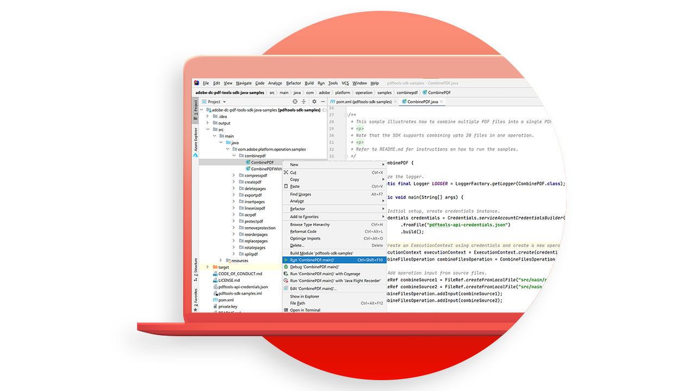

# [!DNL Adobe Acrobat Services] casos de uso de API

## ¿Qué pueden hacer por mí las API [!DNL Adobe Acrobat Services]?

Descubre cómo las API de [!DNL Adobe Acrobat Services] pueden cambiar tu empresa con estos casos prácticos.

### API de [!DNL Acrobat Services]

<table style="table-layout:fixed">
<tr>
  <td>
    
    

    <a href="automatelegalworkflows.md"><strong>Automatizar flujos de trabajo legales</strong></a>
    

    <em>Descubre cómo automatizar los flujos de trabajo legales con contenido condicional</em>
     
  </td>
  <td>
      
      

      <a href="employeeonboarding.md"><strong>Modernización de la incorporación de empleados</strong></a>
      

      <em>Descubre cómo modernizar la incorporación de empleados</em>
       
  </td>
  <td>
      
      

      <a href="acceleratesales.md"><strong>Acelera tu proceso de ventas</strong></a>
      

      <em>Aprende a acelerar las ventas integrando experiencias con documentos</em>
       
    </td>
    <td>
      
      

      <a href="sales.md"><strong>Administrar propuestas de ventas y contratos</strong></a>
      

      <em>Aprende a crear un flujo de trabajo eficiente para automatizar y simplificar las propuestas de ventas</em>
       
    </td>
</tr>
<tr>
  <td>
    
    

    <a href="nda.md"><strong>Creando un acuerdo de confidencialidad</strong></a>
    

    <em>Aprende a crear un PDF de acuerdo de confidencialidad dinámico para colaborar</em>
     
  </td>
  <td>
    
    

    <a href="legal.md"><strong>Administración de contratos legales</strong></a>
    

    <em>Aprende a generar y proteger documentos legales automáticamente con datos personalizados</em>
     
  </td>
  <td>
    
    

    <a href="offer.md"><strong>Administrar cartas de oferta de empleados</strong></a>
    

    <em>Aprende a generar una carta de oferta que se pueda entregar a un nuevo empleado para que la firme</em>
     
  </td>
  <td>
    
    

    <a href="searching.md"><strong>Buscando e indizando</strong></a>
    

    <em>Aprende a crear archivos de PDF en los que se pueden realizar búsquedas a partir de documentos digitalizados</em>
     
  </td>
</tr>
<tr>
  <td>
    
    

    <a href="reviews.md"><strong>Revisiones y aprobaciones</strong></a>
    

    <em>Aprende a crear un flujo de trabajo de revisión y aprobación de documentos para la colaboración entre equipos</em>
     
  </td>
  <td>
    
    

    <a href="reportcreation.md"><strong>Creación y edición de informes</strong></a>
    

    <em>Descubre cómo generar informes de PDF en tu sitio web para los clientes</em>
     
  </td>
  <td>
    
    

    <a href="jobposting.md"><strong>Registro de trabajos</strong></a>
    

    <em>Aprende a desarrollar una experiencia web fluida y coherente para los solicitantes de empleo y los empleadores</em>
     
  </td>
  <td>
    
    

    <a href="educationcollab.md"><strong>Colaboración entre estudiantes y profesores</strong></a>
    

    <em>Aprende a crear una plataforma de aprendizaje en línea que permita a profesores y estudiantes compartir fácilmente recursos en PDF</em>
     
  </td>
</tr>
<tr>
  <td>
    
    

    <a href="agreementworkflowsnodejs-bubba.md"><strong>Flujos de trabajo de acuerdo en Node.js</strong></a>
    

    <em>[!DNL Adobe Acrobat Services] API incorporan fácilmente funciones de PDF en tus aplicaciones web</em>
     
  </td>
  <td>
    
    

    <a href="hragreementworkflowsjava-bubba.md"><strong>Flujos de trabajo de documentos de HR en Java</strong></a>
    

    <em>[!DNL Adobe Acrobat Services] API incorporan fácilmente funciones de PDF en tus aplicaciones web de HR</em>
     
  </td>
  <td>
    
    

    <a href="financeworkflowsjava-bubba.md"><strong>Administrar flujos de trabajo de documentos financieros en Java</strong></a>
    

    <em>[!DNL Adobe Acrobat Services] proporciona todas las herramientas, servicios y funciones necesarios para procesar y extraer datos de los documentos financieros de los PDF</em>
     
  </td>
  <td>
    
    

     
  </td>
</tr>
</table>

### API de generación de documentos

<table style="table-layout:fixed">
<tr>
  <td>
    
    

    <a href="invoices.md"><strong>Administración de facturas</strong></a>
    

    <em>Descubre cómo generar, proteger con contraseña y entregar automáticamente las facturas de los clientes</em>
     
  </td>
  <td>
    
    

     
  </td>
  <td>
    
    

     
  </td>
  <td>
    
    

     
  </td>
</tr>
</table>

### API de incrustación de PDF

<table style="table-layout:fixed">
<tr>
   <td>
    
    

    <a href="ddppdfembedapi.md"><strong>Publicación de documentos digitales</strong></a>
    

    <em>Obtenga información sobre cómo mostrar documentos de PDF incrustados en páginas web mediante la API Adobe PDF Embed</em>
     
  </td>
  <td>
    
    

     
  </td>
  <td>
    
    

     
  </td>
  <td>
    
    

     
  </td>
</tr>
</table>